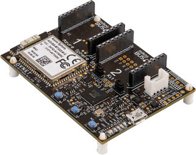
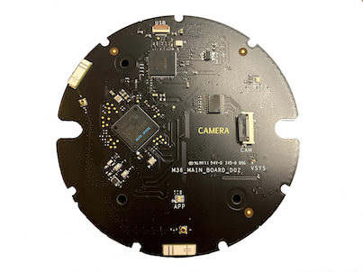

# Careerhack2021 Workshop Manual - AIoT
Two development boards will be used in this workshop. Both of the devices are based on Microsoft [Azure Sphere](https://docs.microsoft.com/en-us/azure-sphere/) technology, which provides a highly secure solution to the IoT devices.

---
## Avnet MT3620 Start Kit
The Avnet Azure Sphere MT3620 Starter Kit supports rapid prototyping of highly secure, end-to-end IoT implementations using Microsoft’s Azure Sphere. The small form-factor carrier board includes a production-ready MT3620 Sphere module with WiFi connectivity, along with multiple expansion interfaces for easy integration of off-the-shelf sensors, displays, motors, relays, and more.

On-board sensors
- 3-Axis accelerometer
- 3-Axis gyro
- Temperature
- Pressure/Barometric
- status LEDs
- 3 * buttons

[Get started with Avnet dev board](./avnet-start-kit.md)

---
## Azure Sphere Vision Kit
The Azure Sphere Vision Kit was built by Microsoft AED Taiwan engineering team. It integrated a QVGA mono camera sensor to facilitate vision applications. The kit can connect to the internet through its embedded dual-band Wi-Fi. An additional NFC module is also integrated to accelerate device provisioning and near-field communication.

On-board sensors
- Mono QVGA camera sensor
- NFC
- status LEDs

[Get started with Vision Kit](./vision-kit.md)

[Machine learning lab - person detection](./tinyml-lab-persondetect.md)

---

## Integrate Azure IoT Central
[steps](./integrate-iot-central.md)
