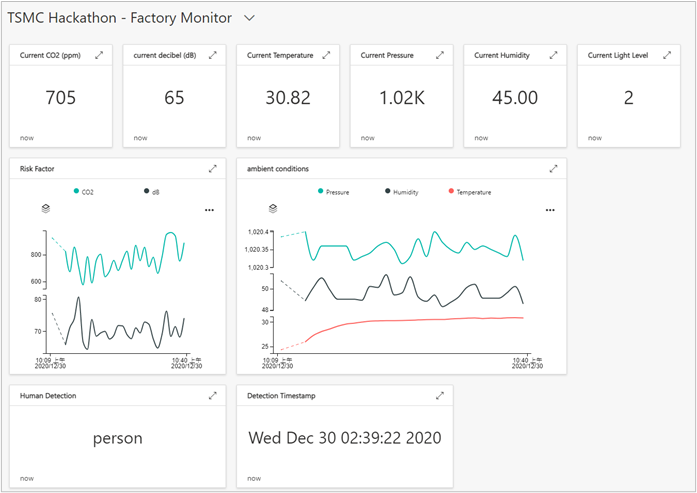

# Avnet Azure IoT lab
## Configure Azure IoT Central
1. [Create an Azure IoT Central application](https://github.com/Azure/azure-sphere-samples/blob/master/Samples/AzureIoT/IoTCentral.md#create-an-azure-iot-central-application)
1. [Configure your Azure IoT Central application](https://github.com/Azure/azure-sphere-samples/blob/master/Samples/AzureIoT/IoTCentral.md#configure-your-azure-iot-central-application)
1. [Set up Azure IoT Central to work with Azure Sphere](https://github.com/Azure/azure-sphere-samples/blob/master/Samples/AzureIoT/IoTCentral.md#set-up-azure-iot-central-to-work-with-azure-sphere)
    - Download the tenant authentication CA certificate
    - Upload the tenant CA certificate to Azure IoT Central and generate a verification code
    - Verify the tenant CA certificate
    - Use the validation certificate to verify the tenant identity
1. [create a device template for avnet dev board](./import-device-template.md)

## Configure local applications
1. Grab a local copy of the lab project
    > https://github.com/sha1painkiller/azureiot-lab-avnetdevkit.git
1. We use lab2 to demonstarte Azure IoT capabilities
    > cd azureiot-lab-avnetdevkit/codes/Lab_2_Send_Telemetry_to_Azure_IoT/
1. Launch Visual Studio and open CMakeList.txt
1. configure app_manifest.json - follow the [instruction](https://github.com/Azure/azure-sphere-samples/blob/master/Samples/AzureIoT/IoTCentral.md#configure-the-sample-application-to-work-with-your-azure-sphere-tenant-and-devices)
    - generate API token on IoT Central
    - run "ShowIoTCentralConfig.exe"
    - fill necessary fields in app_manifest.json
1. Build and run the sample
1. [Check your device telemetries in Azure IoT Central](https://github.com/Azure/azure-sphere-samples/blob/master/Samples/AzureIoT/IoTCentral.md#show-your-device-data-in-azure-iot-central)
    - the dash board should look like this
    
