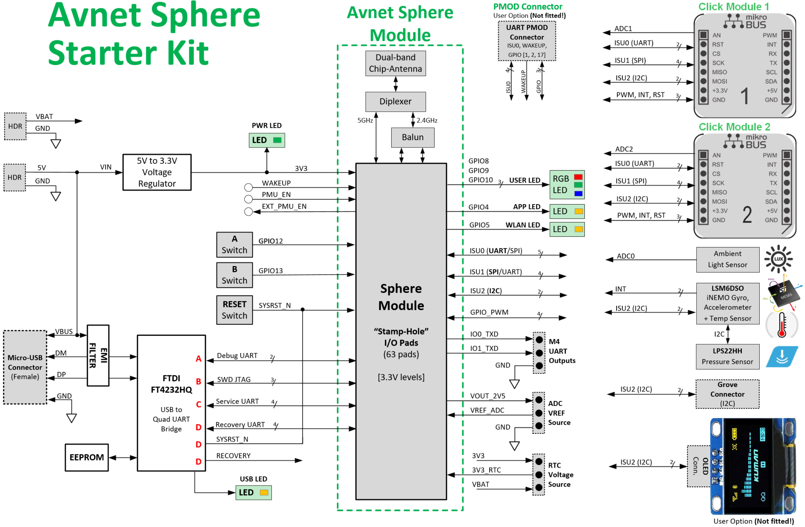

# Avnet Starter Kit
Check [prerequisits](./prerequisites.md) before hands-on labs.
1. Unbox the devkit
2. connect micro-usb plug with Avnet devkit socket and the other end with laptop's USB type-A socket
3. open Azure Sphere CLI on the laptop
    - recover Azure Sphere OS images
4. claim your device ([more](https://docs.microsoft.com/en-us/azure-sphere/install/claim-device?tabs=cliv1))
5. configure network setting ([more](https://docs.microsoft.com/en-us/azure-sphere/install/configure-wifi))
6. (*board setting complete*) [go to project](./avnet-lab-azureiot.md)

---
## Avnet dev board block diagram
