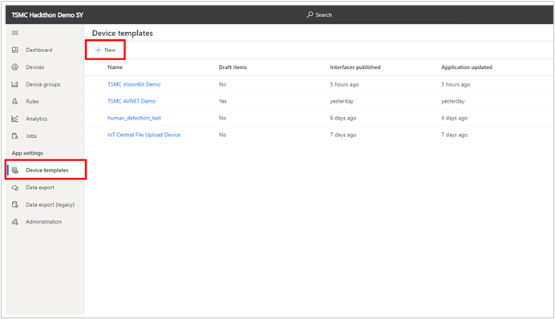

# Import device template to Azure IoT Central
## create a device template
1. Open your IoT Central Application, select Device Template in the left pane and click New to add new device template

    
1. Select IoT Device, and click Next:Customize

    
1. Specify your Device Template Name (ex. AVNET Demo Template), and then click Next:Review

    
1. Click Next. In next page, click Import a model and select the AVNET json file to open

    
1. Click Views and click Generate default views for the device template

    
1. Click Publish to publish the device template in IoT Central Application

    
1. After you publish the device template, you can see the device template in the Device page of the left pane

    

## add a device to the template
1. Open Azure Sphere Developer Command Prompt and type the following command to view the device ID of the Azure Sphere AVNET board. Copy the Device ID (and trun it into the lower case), you will need to use it later

    > \> powershell -Command ((azsphere device show-attached)[0] -split ': ')[1].ToLower()
    >
    > 47e0e1e72e237550175ad98328a35ebcdedcc6a1359a23e866bf04f1e18431c1c74d8fcddfb914531d29820e297b2f9ce2e5dea4d50700000000000000000000

1. Open your IoT Central Application, navigate to the Device > AVNET Demo (or your device template) and click New

    
1. In Device Name, select your custom name. And in the Device ID, fill in the device ID you copied in the previous step. Note that it should be lower case, so you first need to convert the Device ID into lower case. And then click Create to create device

    
