# Create an integrated dashboard on Azure IoT Central
### To integrate multiple device on the same dashboard

1. Navigate to the Dashboard in the left pane of IoT Central and click New to create a dashboard

    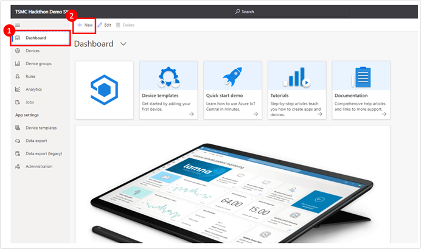
1. After you enter the edit view, first specify your dashboard name.

    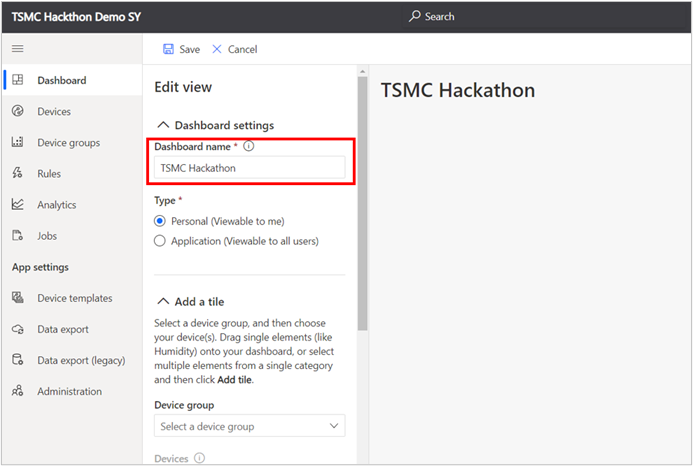
1. add CO2, Decibel from Sphere AVNET to your Dashboard.
    - First Select your AVNET device under Devices Group and Device

        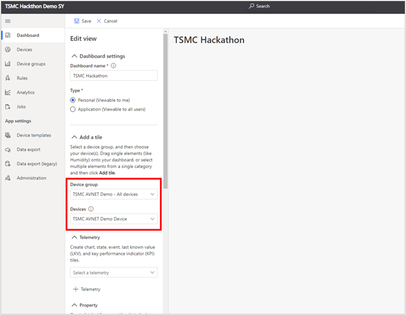
    - In Telemetry section, select CO2 and click Add tile

        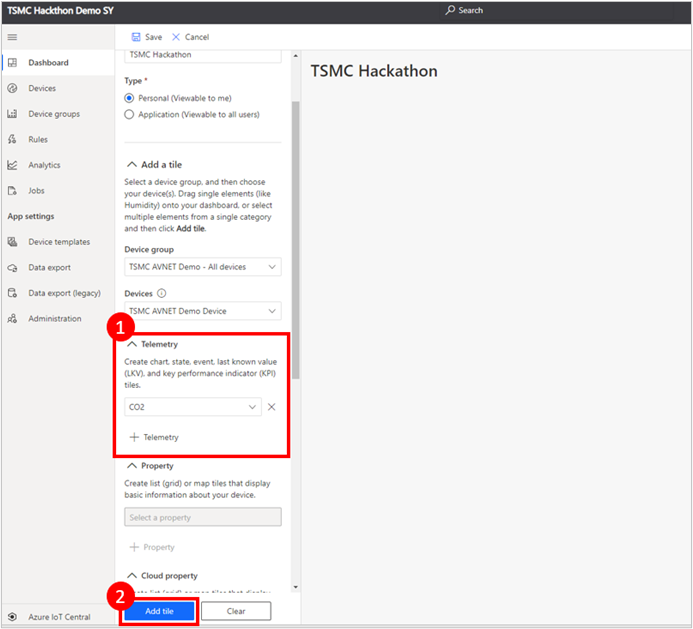
    - In the CO2 tile, click Change Visualization and select Last Known Value

        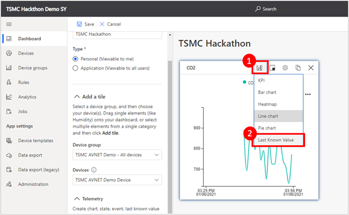
    - Select Size available and change size to 1x1.

        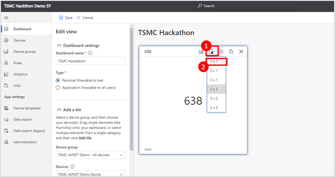
    - Repeat the same steps above to add a Decibel last known value tile in your dashboard. Now your dashboard may be the same as follow.

        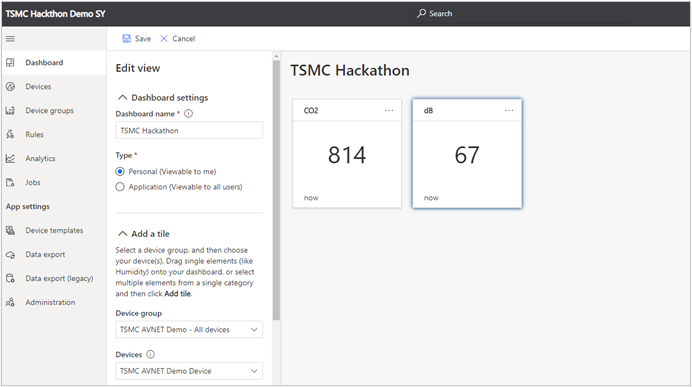
1. Create a Line Chart with combination of CO2 and Decibel.
    - Click Select a telemetry and add CO2.

        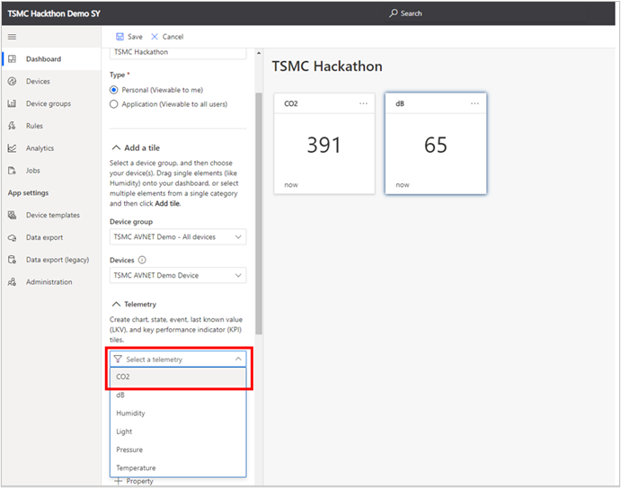
    - Click + Telemetry and Select Decibel

        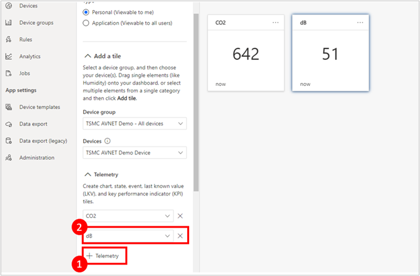
    - Click Add tile to add the tile

        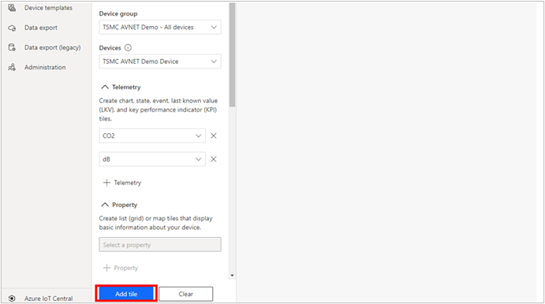
    - Now you can see the Line Chart of CO2 and Decibel in a tile

        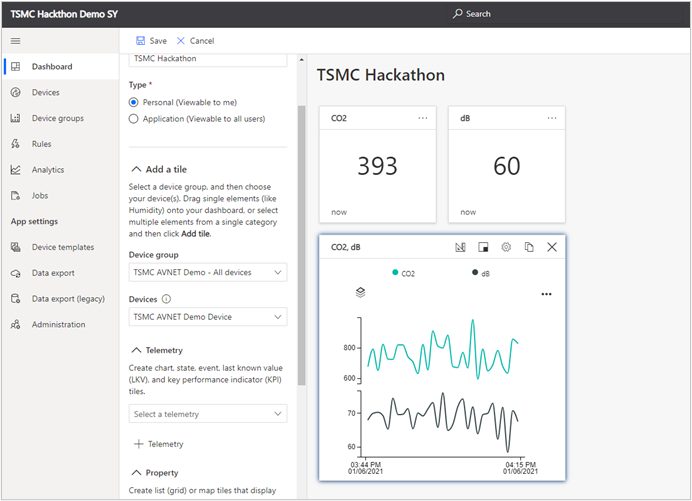
1. Add the Human Detection and timestamp From VisionKit.
    - Under Device Group and Device, select your Azure Sphere VisionKit Device.

        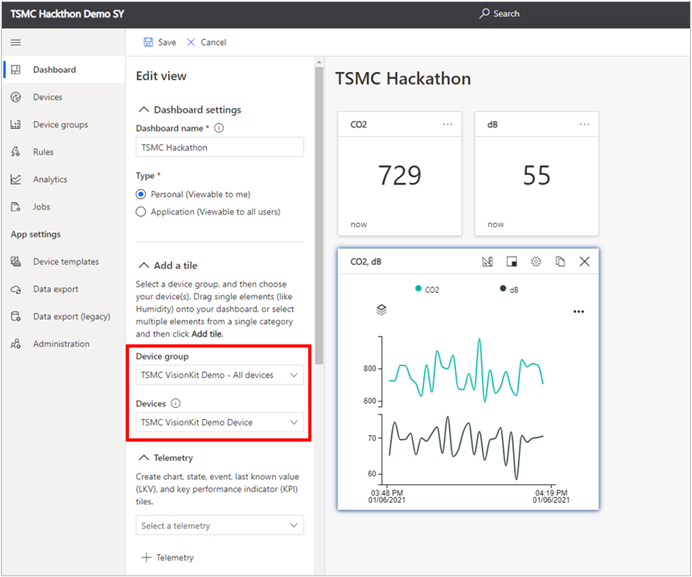
    - Select label in Telemetry and click Add tile

        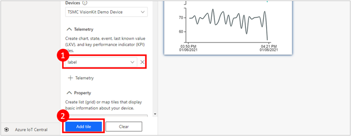
    - Click Change Visualization and select Last Known Value

        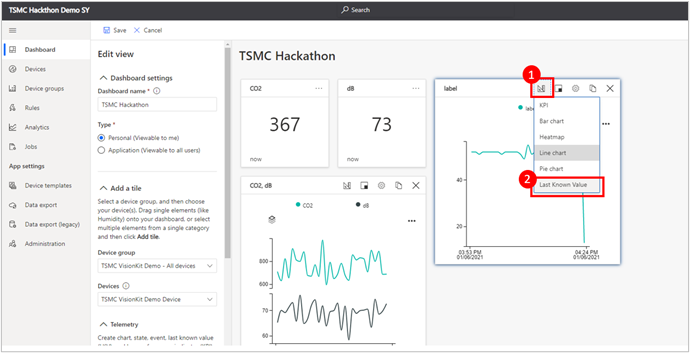
    - Click Size Available and select 2x1

        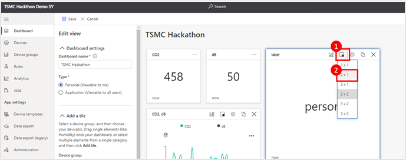
    - Follow the steps above to add a timestamp last known value tile. Now your dashboard may look the same as follow

        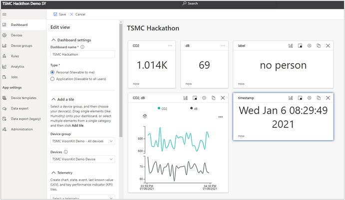
    - Click Save to save your dashboard

        
    - You are welcome to customize the dashboard you want and use the remaining telemetry data. The following is our demo version dashboard.

        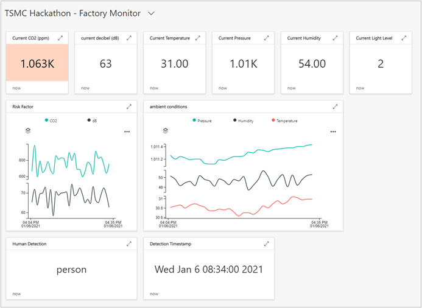
1. Add Rule to your IoT Central.
    - Go to Rules on the left pane and click New to add rule.

        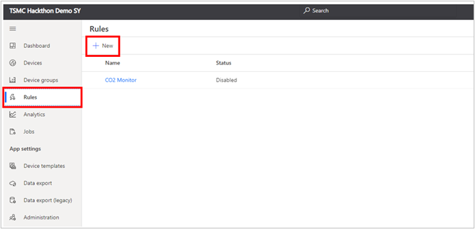
    - To configure your rule, first give your rule a name, and then select the target device. After you specify the device, define the condition (in this example, when CO2 is greater than 1000)

        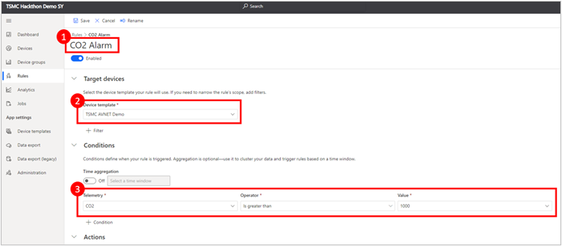
    - In the Actions section, click + Email and key in the Display name, Email (To), and Note. And click Save.

        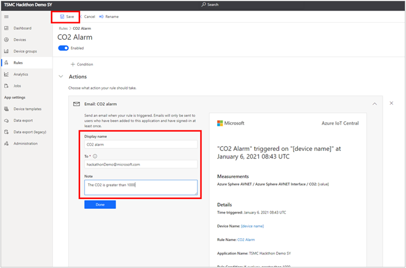
    - Now if the CO2 is greater than 1000, the email address you specified will receive a email to notify.

        

---

*Reference*

- [Create and manage multiple dashboards](https://docs.microsoft.com/th-th/azure/iot-central/core/howto-create-personal-dashboards)
- [Configure the application dashboard](https://docs.microsoft.com/en-us/azure/iot-central/core/howto-add-tiles-to-your-dashboard)
- [Create Rules in IoT Central application](https://docs.microsoft.com/en-us/azure/iot-central/core/tutorial-create-telemetry-rules)
