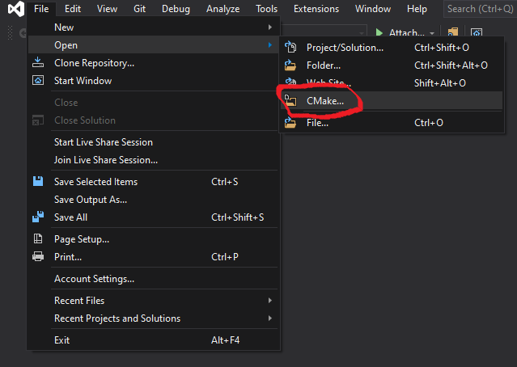
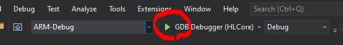

# Tiny Machine Learning lab on Azure Sphere

## Train a person detection ML model
1. Create a small TensorFlow Lite model that can fit into the device 
    - [training a person detection model](https://github.com/tensorflow/tensorflow/blob/master/tensorflow/lite/micro/examples/person_detection/training_a_model.md#training-a-model)
    - [understand the architecture - MobileNets](https://github.com/tensorflow/tensorflow/blob/master/tensorflow/lite/micro/examples/person_detection/training_a_model.md#understanding-the-architecture)
1. Convert the model to FlatBuffer
    - [Quantizing and converting to TensorFlow Lite](https://github.com/tensorflow/tensorflow/blob/master/tensorflow/lite/micro/examples/person_detection/training_a_model.md#quantizing-and-converting-to-tensorflow-lite)
1. Convert the FlatBuffer to C Array
    - [Converting into a C source file](https://github.com/tensorflow/tensorflow/blob/master/tensorflow/lite/micro/examples/person_detection/training_a_model.md#converting-into-a-c-source-file)
1. move the array file to the project space

## Integrate the model with Azure Sphere RT (M4) core projects
M4 core is used for ML computation 
1. launch Visual Studio and open rt-core project CMakeListx.txt
    - {root}/MT3620_M4_NeuroPilot-Micro/app/vs_project/rtcore/CMakeList.txt

    
1. open Azure Sphere CLI in **administrator** privilege mode, and type 
    > azsphere device edv -r
    
    to enable Azure Sphere M4 core debug mode
1. build and deploy the images to Azure Sphere M4 core

    
1. stop the debugger

## High-Level (A7) Core project
A7 core is used to handle system input(camera)/output(cloud connection)
1. launch Visual Studio and open HL-core project CMakeListx.txt
    - {root}/MT3620_M4_NeuroPilot-Micro/app/vs_project/hlcore/CMakeList.txt

    <!---  --->
1. build and deploy the image to Azure Sphere A7 core

    
---

## Block diagram

## Documentation
{root}/MT3620_M4_NeuroPilot-Micro/doc/*
- NeuroPilot-Micro MT3620 Demo v0.2 20200710.pdf
- NeuroPilot-Micro MT3620 Getting started v0.2 20200710.pdf
- NeuroPilot-Micro MT3620 Introduction v0.2 20200710.pdf
- NeuroPilot-Micro MT3620 User Guide v0.2 20200710.pdf