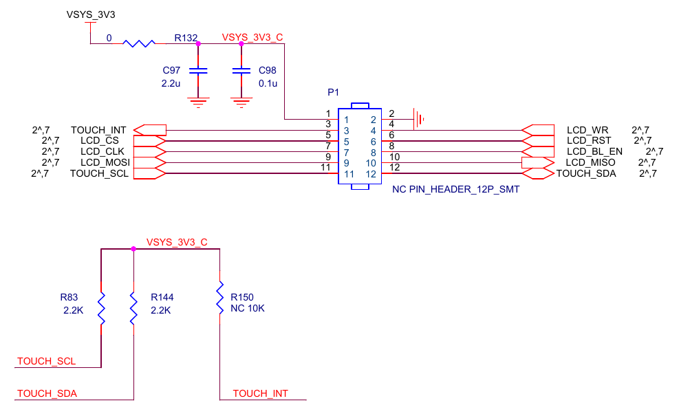
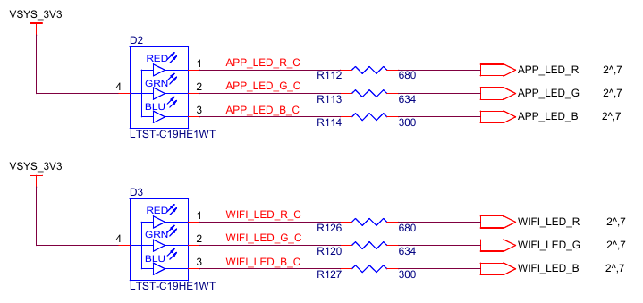
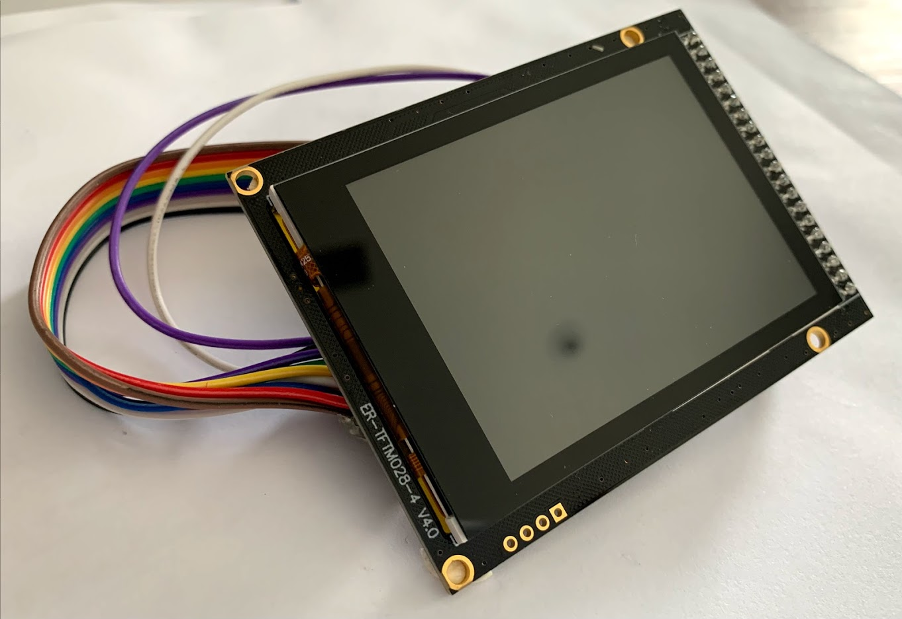

# Azure Sphere Vision Kit
## Check [prerequisits](./prerequisites.md) before hands-on labs.
1. Connect peripherals to the main board (ie. camera, usb, nfc)
1. connect micro-usb plug with visio kit socket and the other end with laptop's USB type-A socket
1. program FDTI EEPROM (for CLI tool to recognize Azure Sphere MT3620)
    - download [azure-sphere-ftdi-eeprom.xml](./azure-sphere-ftdi-eeprom.xml)
    - follow the [instruction](https://docs.microsoft.com/en-us/azure-sphere/hardware/mt3620-mcu-program-debug-interface#ftdi-ft_prog-programming-tool) 
1. open Azure Sphere CLI on the laptop
    - recover Azure Sphere OS images
    > azsphere device recover
1. login Microsoft account
    > azsphere login
1. claim your device ([more](https://docs.microsoft.com/en-us/azure-sphere/install/claim-device?tabs=cliv1))
1. configure network setting ([more](https://docs.microsoft.com/en-us/azure-sphere/install/configure-wifi))
1. (*board setting complete*) [go to project](./tinyml-lab-persondetect.md)

## Schematics
- LCD headers

    
- LED

    

## accessaries
Reference display panel in this project 
- 
- 2.8"TFT Touch Shield for Arduino w/Capacitive Touch Screen Module
- Pin Header Connection-4-Wire SPI
- VDD 3.3V
- 2.8"Capacitive Touch Panel (for MNIST hand writing recognition)
- you can buy it from [here](https://www.buydisplay.com/2-8-inch-tft-touch-shield-for-arduino-w-capacitive-touch-screen-module)

